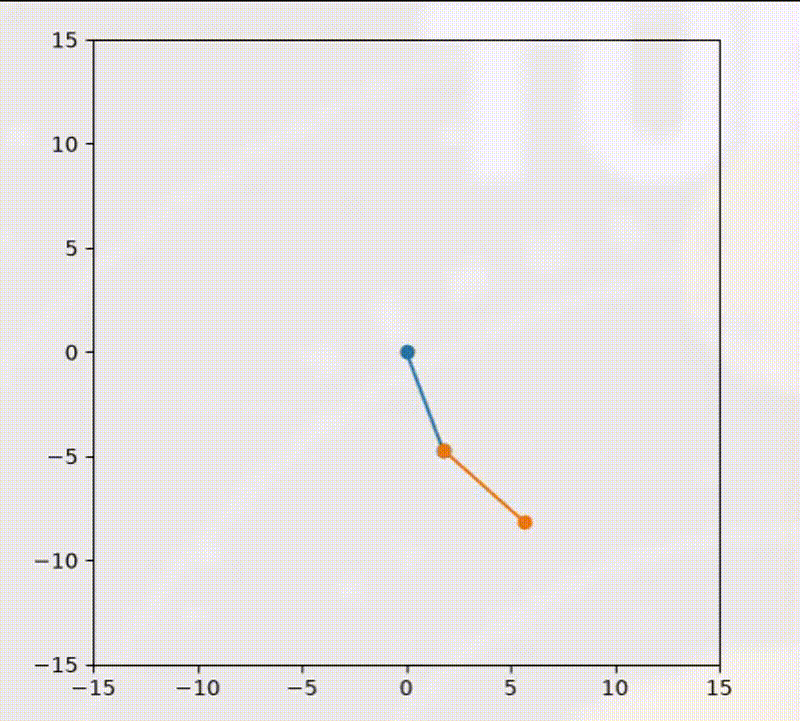

## Double Pendulum Project
A simple double pendulum simulation using matplot.

## Requirements
numpy >= 2.5.1
matplotlib >= 3.11.0

## Usage
```
git clone https://github.com/Austxnsheep/Python-Double-Pendulum/new/main?filename=README.md
cd Python-Double-Pendulum
python -m venv .venv
source .venv/bin/activate
pip install -r requirements.txt
python main.py
```

## Demo


